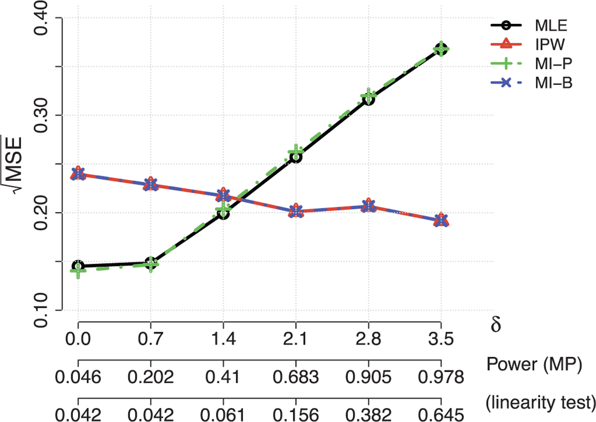

## Outline

### Day 1, Session 1

- Introduction to two-phase sampling
- Survey package
- Raking of weights

### Day 1, Session 2

- Fitting regression models in two-phase data
- Influence functions and imputation for raking
- Connections to AIPW estimation

------------------------------------------------------------------------

### Day 2, Session 1

- Optimal sampling for two-phase designs
- Neyman allocation and influence functions
- Multiparameter optimisation
- Multiwave designs
- Strata vs individual probabilities

### Day 2, Session 2

- Analysis approaches beyond weighting
- Contiguous misspecification
- Discussion and wrap-up

------------------------------------------------------------------------

### Session structure

First three sessions:

- 45 min lecture
- 30 min exercise
- 15 min discussion.

(no exercises in last session)

------------------------------------------------------------------------

## Introduction

Me:

- theoretical biostatistician based in Auckland, New Zealand
- part of Bryan Shepherd/Pamela Shaw research group
- sings baritone

You?

# Two-phase sampling

In which we do one thing after another

## Two-**phase** sampling

- Phase 1: take a sample of $N$ ($\pi_{1,i}$)
  - (or pretend your cohort/database is a sample)
- Phase 2: take a subsample of $n$ ($\pi_{2|1,i}$)
  - phase-2 sampling probabilities can depend on any phase-1 data

Weight using reciprocal of $\pi^*_i=\pi_{1,i}\pi_{2|1,i}$

**Q:** Why is this **not** the probability $i$ is in the subsample?

------------------------------------------------------------------------

## Nested case-control

Binary outcome $Y$ measured on whole cohort

Stratified sampling: all cases, same number of controls

Measure exposure $X$ on cases, controls

## Case-cohort

Sample $m$ people from cohort and measure $X$

Also measure $X$ on everyone who has an event

## Binary measurement-error

Measure $Y$ and error-prone variable $A$ on whole cohort

- subsample same number from each cell of $A\times Y$
- measure true $X$ on subsample

## EHR data

Measure $Y$ and *many* $Z$, $A$ on whole cohort

- subsample small number of people to validate against clinical notes
- measure many $X$ on subsample

## General case

- Want to fit $Y\sim X+Z$
- Measure $Z$, $A$, perhaps $Y$ on everyone
- Measure $X$, perhaps $Y$ on the subsample
- $R$ is subsampling indicator

Sometimes $A$ predicts $X$ well, sometimes not

Sometimes $Z,A$ is high-dimensional, sometimes not

Sometimes $X$ is high-dimensional, sometimes not

*We will usually take* $\pi_{i,1}$ to be constant: iid sample at phase 1

# Inference and computation

## Weighting

$w_i=1/{\pi^*_i}$ or $1/\pi_{2|1,i}$ are *design* or *grossing-up weights*

Person $i$ in the subsample **represents** $w_i$ people in the population/cohort.

$$E[\color{red}{w_iR_i}]=E\left[\frac{R_i}{\pi_i^*}\right]=1$$ **We can put** $\color{red}{w_iR_i}$ into any sum over $i=1,\dots,N$ to get a weighted sample version

Unlike most surveys, we (typically) don't have non-response

## Two levels of randomness

Cohort was random: we would have (?model) uncertainty even with complete data

Subsample is random: we have pure sampling uncertainty

## Totals

Whole-cohort total (*census parameter*): $\tilde{T}_X=\sum_{i=1}^N X_i$

Estimator: $\hat T_X=\sum_{i=1}^N \color{red}{w_iR_i} X_i$

$$\mathrm{var}[\hat T_X]= \mathrm{var}[E[\hat T_X|\text{phase 1}]]+E[\mathrm{var}[\hat T_X|\text{phase 1}]]$$ First term is full-cohort $\mathrm{var}[\tilde T_X]$, second is sampling variance

## Computation

```         
library(survey)
cc_design<-twophase(id=list(~1,~1), 
    strata=list(NULL, ~y), 
    subset=~in_sample,
    data=data)
```

## Using the whole cohort

We have $A$ on everyone, not just subsample

- imputation? (model assumptions)
- calibration/raking/post-stratification

Adjust the weights to use the whole-cohort information

## Using the whole cohort

We have $A$ on $N-n$ unsampled people.

Define raking variables $H_i=H(A)$ and compute raking adjustments $g_i$ so that

$$\sum_{i=1}^N \color{blue}{g_iw_iR_i}H_i=\sum_{i=1}^N H_i$$

- There is *no* subsampling error in $\sum_{i=1}^N \color{blue}{g_iw_iR_i}H_i$
- There is *reduced* subsampling error for anything correlated with $H_i$

------------------------------------------------------------------------

### Impact

Before raking

$$\text{var}[\hat T_X]=\sum_{i,j=1}^n w_iX_i\,w_jX_j\,\text{cov}[R_i,R_j]$$

After raking

$$\mathrm{var}[\hat T_X]=\sum_{i,j=1}^n g_iw_ie_i\,g_jw_je_j\,\mathrm{cov}[R_i,R_j]$$

where $e_j$ are **residuals** from regressing $X$ on $H$

------------------------------------------------------------------------

## Good raking variables

Data: California Academic Performance Index 1999-2000 on 6194 schools

- many school-level variables (socioeconomic, procedural)
- API 1999,2000: school standardised test results
- `enroll`: school size

`api99`, `api00` very strongly correlated. Pretend `api00` is phase 2 $Y$, api99 is phase 1 $A$.

## Means and totals

```{r echo=TRUE}
library(survey)
data(api)
apipop$instrat<- apipop$snum %in% apistrat$snum
dstrat2ph<-twophase(id=list(~1,~1), strata=list(NULL,~stype), 
                     subset=~instrat,data=apipop)
svymean(~api00, dstrat2ph)
svymean(~enroll, dstrat2ph)
```

## Use all of `api99`

```{r echo=TRUE}
dcal1 <- calibrate(dstrat2ph, ~api99, phase=2)
svymean(~api00, dcal1)
svymean(~enroll, dcal1)
```

`api99` strongly correlated with `api00`, but not with `enroll`

## Same idea for `enroll`

```{r echo=TRUE}
dcal2 <- calibrate(dstrat2ph, ~api.stu+api99, phase=2)
svymean(~api00, dcal2)
svymean(~enroll, dcal2)
```

- `api99` strongly correlated with `api00`
- `api.stu` number of students taking test correlated with total enrollment

## Imputation?

One way to do raking is to use weighted linear regression 

- impute `api00` from `api99` for everyone (no uncertainty to first order)
- $\hat X$ is a linear function of $X$, so is just reweighting
- add Horvitz-Thompson estimator of $\texttt{api00}-\widehat{\texttt{api00}}$

Variance comes from the second step, so is just variance of residuals

$\mathrm{var}[\hat T_X]=\sum_{i,j=1}^n g_iw_ie_i\,g_jw_je_j\,\mathrm{cov}[R_i,R_j]$


## Free lunch!

If the subsample genuinely is a probability sample with known $\pi_i$, there are no additional assumptions for raking/calibration!

- (proof idea: predicting `api00~api99` has mean zero error *by construction*)
- Same free lunch as baseline adjustment in RCT
- linked by idea of randomisation as sampling conditional outcomes

## Digression: unfree lunch

If the subsample does not have known true $\pi_i$ you can estimate the $\pi_i$ by by logistic regression and then do raking

- resulting estimator is doubly-robust estimator
- it's pretty good, too (Williamson *et al*, 2026 *Stat Med*)

## Imputation

We used single variables, but you can use any combination that predicts $X$

We actually use a slightly different estimator that can't produce negative weights

**Multiple imputation** to do raking is valid (and actually sensible for regression: next session)

# Exercises

# Discussion

# Break

Coffee?

# Regression models

In which a line must be drawn

## Questions

- how do we do weighted estimation?
- how do we estimate uncertainty?
- what are good raking variables?
- isn't it horribly inefficient? *(tomorrow)*
- why isn't it all well known?

------------------------------------------------------------------------

### Subsampled history of weighted estimation

- Neyman (1938): 'double sampling'
- White (1982): two-phase sampling in epi
- Valliant (1993): variance estimation after post-stratification
- Binder (1983, 1996): estimating equations
- Deville, Särndal (1992, 1993): arbitrary raking variables
- Robins, Rotnitzky, Zhao (1994): AIPW, efficiency
- Breslow et al (2009): "Using the whole cohort..."
- Lumley, Shaw, Dai (2010): Connecting the literature
- Lumley: `survey` package implementations

## Fitting models in two-phase samples

Again: $(Y,Z,A)\mid (R,X)$

For point estimates we can just put $w_i$ in the objective function

$\tilde\ell(\theta)=\sum_{i=1}^N \ell_i(\theta)$

giving the census parameter $\tilde\theta$, goes to

$\hat\ell (\theta)=\sum_{i=1}^N \color{red}{w_iR_i}\ell_i(\theta)$

giving the weighted estimator $\hat\theta$

## Influence functions

Suppose we can write in iid data $$\sqrt{N}(\tilde\theta-\theta)=\frac{1}{\sqrt{n}}\sum_{i=1}^N h(X_i,Y_i,Z_i;\theta)+o_p(1)$$

$h_i=(X_i,Y_i,Z_i;\theta)$ are **influence functions**

Influence functions turn any statistic into a sum!

------------------------------------------------------------------------

### Examples

- OLS Regression: $h_i=n(X^TX)^{-1}x_i(y_i-x_i'\beta)$

- If $\hat\theta$ solves $U(\theta)=\sum_i U_i(\theta)=0$ then $$h_i=E\left[\frac{1}{n}\frac{\partial U}{\partial\theta}\right]^{-1}U_i(\theta)$$

## Influence functions!

- variance of $\hat\theta$ is variance of $\sum_i\color{red}{w_iR_i}h_i$
- variance after raking projects $h_i$ orthogonal to $H_i$
- good raking variables $H_i$ are correlated with $h_i$
- optimal design for $\sum_i h_i$ is optimal for $\hat\theta$

Everything looks like a sum!

$\scriptsize \text{(not lasso, quantiles, mixed models)}$

## Good raking variables

Data: California Academic Performance Index 1999-2000 on 6194 schools

- many school-level variables (socioeconomic, procedural)
- API 1999,2000: school standardised test results

`api99`, `api00` very strongly correlated. Pretend `api00` is phase 2 $Y$, api99 is phase 1 $A$.

## Correlated with $h$?

Consider `api00~enroll+ell+emer`

$$h_i = (Z^TZ)^{-1}(1, z_1, z_2, z_3)^T(\texttt{api00}-\mu)$$

- Is `api99` correlated with $h$?
- Are the $Z$s correlated with $h$?
- How about $$\tilde h_i = (Z^TZ)^{-1}(1, z_1, z_2, z_3)^T(\texttt{api99}-\mu)$$

## Good raking variables

Good raking variables will be $h$ for some related model

- impute $X,Y$ from phase 1
- fit model to imputed data (only!)
- extract influence functions

Raw $X$, $Y$, $Z$ will only be good for discrete (nearly-)saturated models


## Why isn't this well known?

- Hybrid of biostat and survey sampling literature
- Weighted estimators look inefficient
- Not likelihood based, hard to Bayesian
- Not well supported by software

# Bye for now

Same time tomorrow

--------------------------------------------------------------------------

# Optimal design

In which some have a better chance than others

# But first!

**Questions**?

## Optimal design

Suppose we are given an population divided into $K$ strata, and one variable

- Stratum $k$ has $N_k$ people in the population
- a variable $Y$ has variance $\sigma^2_k$ in stratum $k$

Want to estimate the population total (or mean) of $Y$

$$\mathrm{var}[\hat T_Y]= \sum_k N_k^2\sigma^2_k/n_k$$ given $\sum_k n_k=\text{allowed }n$

## Solution

- Continuous approximation (Neyman, 1934): $n_k\propto N_k\sigma_k$
- Straightforward exact algorithm (Wright, 2012, 2017)

Optimal stratum choice is harder, but we know

- stratum all the same size
- stratum size = 2 is ideal
- (post-stratification needs larger strata)

## Regression models

How do we translate this result to optimal design for estimating a $\beta$? 🤔

## Regression models

How do we translate this result to optimal design for estimating a $\beta$?

**Influence functions!!**

$$n_k\propto N_k\sigma_k$$

where $\sigma^2_k$ is now the variance of the efficient influence function for $\beta$ in the complete cohort

## Imputation

Estimating $\sigma_k$ for influence functions needs simulation of $X$ (?obviously)

- Single imputation based on $Z$, $A$ to get $\hat X$, fit to get $\hat h$
- Multiple imputation based on $Z$, $A$, $Y$ to get $X^*_{(m)}$, fit to get $h^*_{(m)}$, average to get $\hat h$

Gives optimal design for IPW, works ok for raking

## Multiple parameters

Need to reduce $\mathrm{var}[\hat\beta]$ matrix to a single metric

- A-optimal: trace
- D-optimal: determinant
- E-optimal: maximum eigenvalue
- I-optimal: average prediction variance

A-optimal is easy: take $\sigma^2_k$ as the sum of variances of influence functions and do Neyman-Wright allocation. Others probably need numerical optimisation.

## Optimal for raking?

Need to estimate $\sigma^2_k=\mathrm{var}[h-\hat h]$, but we estimated $\mathrm{var}[h]$ by approximating with $\mathrm{var}[\hat h]$

## Multiwave sampling

Take the phase-two sampling incrementally in multiple steps

Helps with two problems

- we don't know $\beta$
- we don't know $\sigma^2_k$
- (we don't know what's wrong with the data)

## Sampling

- Impute with current $X$, all phase 1
- Estimate $\sigma^2_k$
- Do Neyman-Wright allocation to get $n_k$
- Divide $n_k-n_k^{old}$ over future waves (or zero if $n_k\leq n_k^{old}$ )

## Choosing waves

- two waves is better than one.
- diminishing returns with many waves, but cost is fairly small.
- first wave needs not to be too small
- first wave needs not to be larger than optimal $n_k$ in any strata

\[Reilly, 1996; McIsaac & Cook, 2015; Chen & Lumley 2020,2022\]

## Individual sampling?

Instead of (?arbitrary) strata, can we optimise sampling probabilities per individual?

- Yes
- Turns out to be a bad idea

## Optimal $\pi$

The optimal probabilities are known (Lagrange multipliers)

$$\pi_i \propto \|h_i\|$$ where $\|h_i\|$ is just the absolute value for a single parameter and the Euclidean norm for $A$-optimality with multiple parameters.

## From $\pi$ to sample

Can sample

- independently with probabilities $\pi_i$ (random sample size)
- sequentially with probabilities proportional to remaining $\pi_i$ (doesn't give $\pi_i$ as probabilities)

More *flexible* than stratified sampling

## Negative correlations

The Horvitz-Thompson variance estimator is $$\sum_{i,j} \frac{h_i}{\pi_i}\frac{h_j}{\pi_h}\frac{\mathrm{cov}[R_i,R_j]}{\pi_i\pi_j}$$

- Poisson/sequential has $\mathrm{cov}[R_i,R_j]\approx 0$ for $i\neq j$
- Stratified sampling has $\mathrm{cov}[R_i,R_j]< 0$ for $i\neq j$

Under stratified sampling only within-stratum differences contribute to the total variance!!

# Exercises

# Discussion

# Break

Coffee?

# Maximum likelihood

In which models are the evidence of things not seen

## Agenda

We have not been assuming the outcome model $Y|X,Z$ is correctly specified

The *semiparametric information bound* is much worse if you don't assume $Y|X,Z$ is correct

Now look at semiparametric likelihood analyses:

- The Auckland school: NPMLE for discrete phase-1 data (`missreg3`)
- Tao, Lin, Lotspeich *et al*: NPMLE for continuous phase-1 data and arbitrary measurement error (`sleev`)

# General principles

## Analysis

Model assisted:

- inference is valid for misspecified models
- correct models give more efficient results
- nearly-correct models are almost as good

Model assisted:

- correct models give large efficiency gains over weighting
- inference is invalid for misspecified models
- nearly-correct models can be seriously inferior

## Design

Model assisted

- anything could happen where we don't look
- need to sample everywhere ($\pi>0$)
- design is robust to small model changes

Model-based

- the model tells us what is happening everywhere
- some zero sampling probabilities may be optimal
- design is sensitive to small model changes

## Case-control logistic regression

- Model-assisted: weighted logistic regression (`svyglm`)
- Model-based: unweighted logistic regression (`glm`) is MLE (Prentice & Pyke) and is fully efficient (Breslow, Robins, Wellner)

Large efficiency gains with model-based estimation, but mostly for strong effects of continuous covariates. Gain is sensitive to model correctness.

Optimal **design** is roughly the same for both: equal numbers of cases and controls

## Misspecification

The benefit of MLE over raking is $O(n^{-1/2})$ when the model is correct, so we must also care about $O(n^{-1/2})$ biases from misspecification.

These are misspecifications that are not reliably detectable: an omitted variable with $\delta/\sqrt{n}$ coefficient can be detected asymptotically with power $<1$ depending on $\delta$.

Han *et al* (2021) confirmed that worst-case directions of misspecification will make the MLE less accurate than weighted estimation (for estimating the full-cohort best-fitting model.)

## Worst-case behaviour



This is **universal** (contiguity)

------------------------------------------------------------------------

Take-home message

- MLE can sometimes provide large precision gains
- Gains are sensitive to *exact* model specification (untestably good)
- *you pays your money and you take your choice*

## Multiple imputation

- If the models are correct, MI will give the MLE as the number of imputations $\to\infty$
- Lots of software out there
- Two-phase designs tend to have very high missing rates...

Giganti *et al* (2020) looked at validation studies by imputation.


## Generalising case-control

Chris Wild & Alastair Scott (*et al*), Breslow (*et al*)

Given a model for $Y|X,Z$ and a sampling rule for $R|Y,Z,A$ we can derive sampling weights from the model and the population distribution of $Y,Z,A$

Need discrete strata $S=Y\times A$ but not discrete $X,Z$

Using these weights instead of design weights or post-stratification weights gives maximum likelihood estimates. (needs iterative maximisation)

## Eg

`missreg`

## Extensions

- $Y$ can be continuous: need to make finite set of bins for strata
- logistic mixed models: genetics, longitudinal

## Limitations

Phase 1 data

- are only used as sampling strata
- must be discrete, low-dimensional
- Strata must be perfect surrogates: $[Y|Z,X,S]=[Y|Z,X]$

## Continuous phase 1

- \[Y\|X,Z\] correctly specified
- $X$ with measurement error is an $A$
- $Y$ with measurement error is an $A$
- measurement error distribution is nonparametric
- phase 1 has to be low dimensional (eg, two-d)

## Sieve estimation: `sleev`

Fit parametric models getting more flexible with increasing $n$

- $B$-splines for distribution of measurement errors given $A$
- If flexibility increases at the correct rate, this works like semiparametrics (cf regression splines)
- Risk: can be too parametric for small $n$, too much work for large $n$
